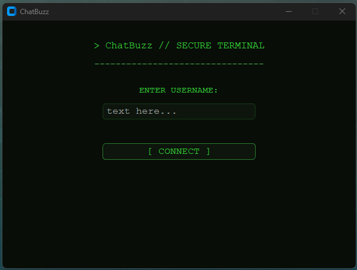
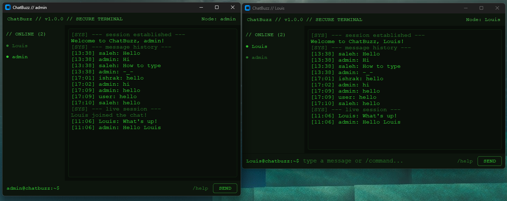
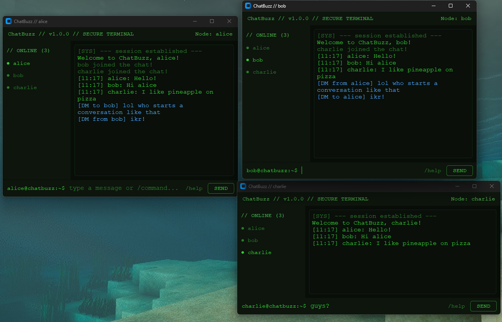
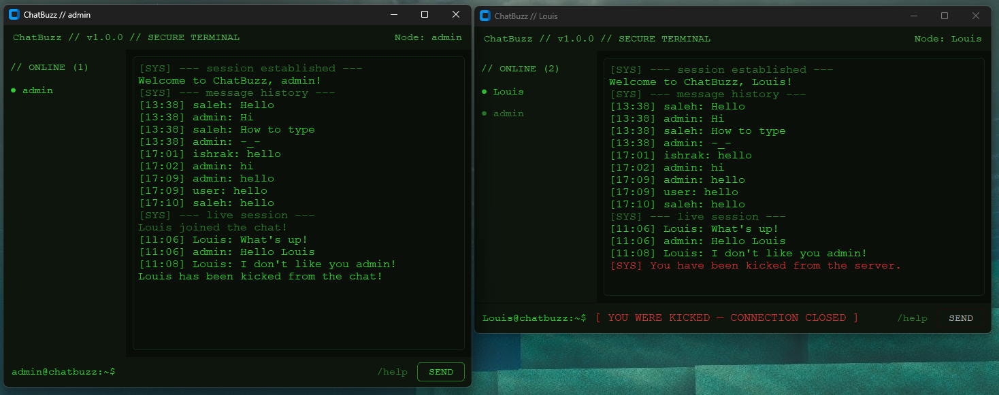
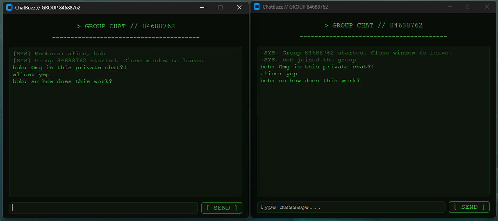

# ChatBuzz

A terminal-aesthetic TCP chatroom built in Python. Real-time messaging over raw sockets with a
CustomTkinter GUI, SQLite message history and a full admin permission system. Started as a project for Computer Network course

---

## Screenshots

### Login


### Chat


### DM


### Kick


### Group Chat


---
## Stack

- Python 3.13.5
- customtkinter (GUI)
- socket + threading (networking)
- sqlite3 (message history + ban list)

---

## Project Structure

```
ChatBuzz/
|-- client/
|   `-- client.py
|-- server/
|   |-- server.py
|   |-- handler.py
|   |-- state.py
|   `-- commands.py
|-- database/
|   `-- db.py
`-- config.py
```

---

## Setup

**Install dependency:**
```
pip install customtkinter
```

**Windows (venv activation):**

Open a terminal and wait 2-3 seconds for the auto-activation command to appear, then run it:
```
(Set-ExecutionPolicy -Scope Process -ExecutionPolicy RemoteSigned) ; (& c:\CodeStudyStuff\Python\Projects\ChatBuzz\.venv\Scripts\Activate.ps1)
```

---

## Running

**Start the server first:**
```
python -m server.server
```

**Then launch client(s) in separate terminals:**
```
python -m client.client
```

Server runs on `127.0.0.1:55555` by default. Edit `config.py` to change host or port.

---

## Features

**Regular users**
- Real-time group chat
- Message history on join (pulled from SQLite)
- `/dm <user> <message>` for private messaging
- `/group <user1> <user2>` for temporary group sessions
- `/help` for available commands

**Admin**
- `/kick <user>` and `/ban <user>` with reason prompt
- `/unban <user>` to restore access
- `/banlist` to view all banned users
- Full access to DM and group commands
- Duplicate admin session blocked

---

## Limitations

- Local network only (127.0.0.1 hardcoded by default)
- Admin password is hardcoded (`admin@123`)
- No message encryption
- No persistent user accounts or authentication
- Single general channel only (groups are temporary and dissolve on last leave)
- No file or media sharing

---

## Future Scope

- LAN or internet deployment with configurable host
- NLP-based spam and toxicity detection on incoming messages
- Sentiment analysis on chat history using stored SQLite data
- Proper authentication system with hashed passwords
- Multiple persistent channels
- End-to-end encryption

---

## Notes

- The SQLite database is auto-created on first server start
- Banned users are blocked at connection before entering the chat
- Each client runs on its own thread server-side
